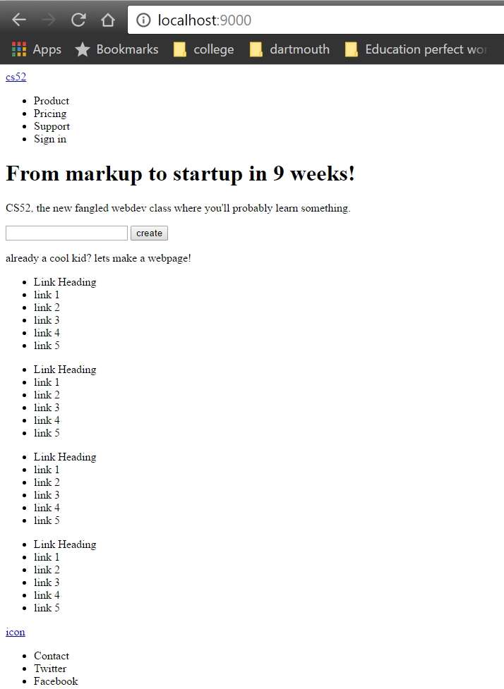
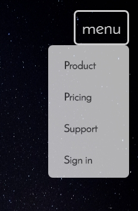
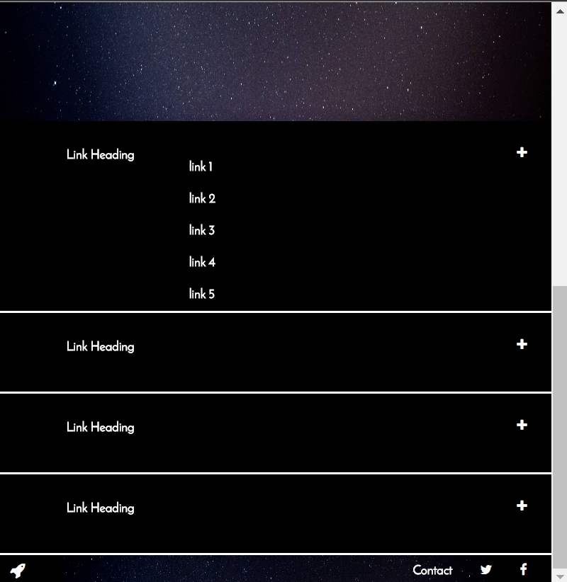

# Shirley's Landing Page!

## Screenshots

* layout

* Mobile menu

* Expanding links

* other stuff
    * The rocket icon on top right corner swings when you hover over it :)
    * Bottom right corner icons' color change when you hover
    * Create button has the clicky motion

## What worked and didn't work
* I got the mobile menu and expandable links extra credit part to work. YAY
* I tried to get the menu to cover the whole  page when clicked on in the mobile version but it didn't work so I had a dropdown menu instead
* I wanted to have a little transition when the links expanded but didn't work so it's kinda ugly
* I wanted to have the text ease in. It was semi successful because they did ease in but when the mouse left the page the text also disappears until the mouse returns. So I just took that part out.
